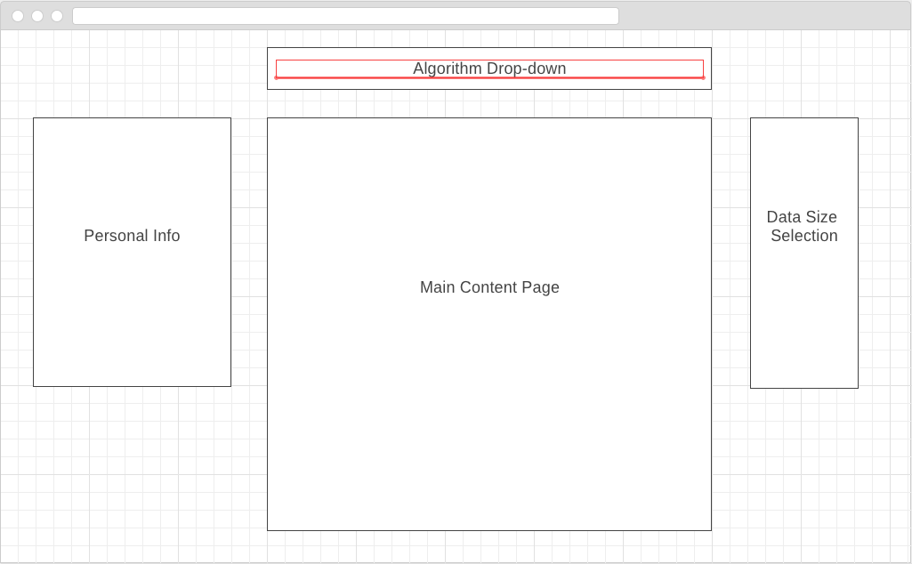

# sort-me

A way to visualize sorting algorithms in real-time!

1. Select a sorting algorithm.
2. Populate it with varying sizes of data.
3. Let it run and see the results!

This project will only be using jQuery for rendering algorithms.

### Wireframes

Sort Me will consist of a main content section in the middle to display the unsorted data in the form of bars varying in size. All animation related to the visualization of sorting will be rendered in the main content section. Above the main content section will be an algorithm drop-down which a user can click on to select the various sorting algorithms to see. This will also contain a button that the user will click in order to run the animation. On the right side, will be a data size selection which will feature data of varying sizes to compare the effects of data size on each algorithm. This area will also display the amount of time it took to sort. Finally, on the left will contain all of my personal information, including links to this github, as well as links to my LinkedIn profile for nessecary contact.

### Implementation Timeline

Day 1 - Prepare each sorting algorithm that will be featured in this application. This will also include a time calculation to be used for frontend display.

Day 2 - Set up basic frontend layout, including main content section, algorithm dropdown, data size selection, and personal contact information.

Day 3 - Physically render algorithms in the main content section and create animation.

